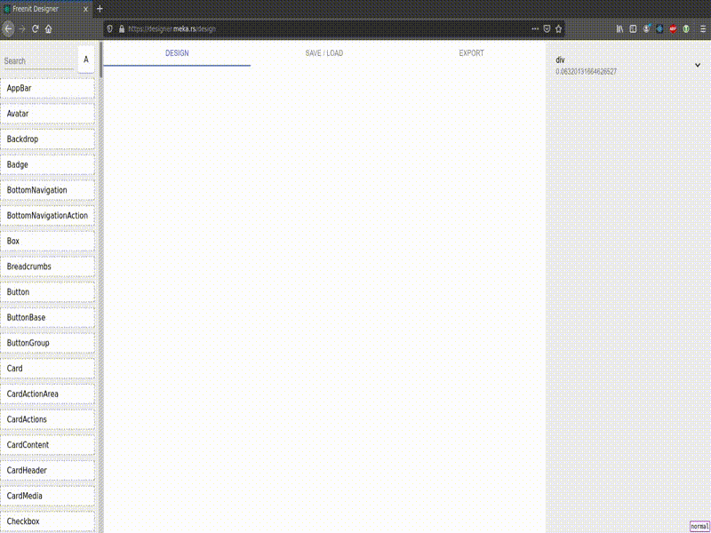

# Freenit Designer

There are 3 tabs that show current design and two modes for editing. Available tabs:
* Design (where you'll DnD, edits and rearanging)
* Load/Save (where you can save your work and load it some other day to continue your work on design)
* Export (converts design to React code)

Modes are:
* Add - If you drag component A to component B, A will become B's child
* Rearange - If you drag component A to component B, B has parent C, A will become C's child and placed right before B

To enter `rearange` mode, press `Shift` key. To exit that mode and switch back to `add`, release `Shift`.

